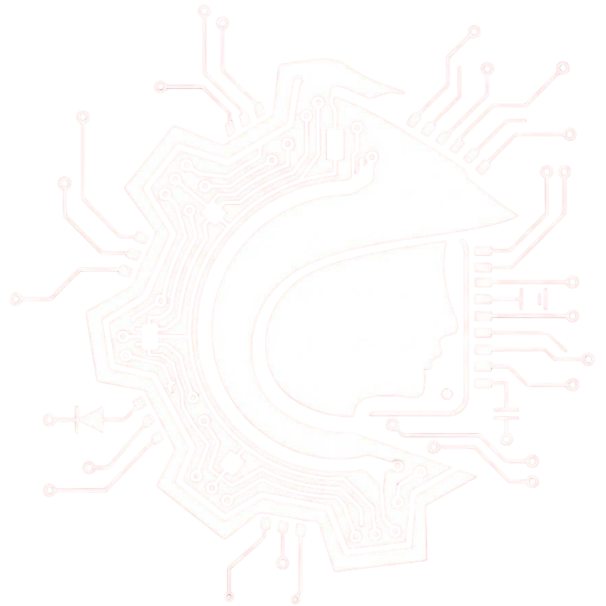

<div align="center">
  

  # MinervaCore 🧠
  
  **O Núcleo de Conhecimento e Documentação Oficial da MinervaBots (UFRJ)**
  
  [](https://github.com/MinervaBots/MinervaCore/actions)
  
  
  

  [Ver Documentação Online 🚀](https://minervabots.github.io/MinervaCore/)
</div>

---

## 📖 Sobre o Projeto

O **MinervaCore** é uma plataforma central de documentação de conhecimento técnico. 

O objetivo deste projeto é centralizar o conhecimento técnico da equipe, facilitando o onboarding de novos membros e servindo como referência rápida para desenvolvimento de projetos robóticos dentro da MinervaBots.

Construído sobre o **Docusaurus 3**, o site oferece uma experiência moderna, rápida e otimizada para leitura técnica.

---

## 🚀 Como Rodar Localmente

Para contribuir com a mudanças no site, siga os passos abaixo.

### Pré-requisitos
* **Node.js** (Versão 20 ou superior recomendada. Testado na v22).
* **Git**.

### Passo a Passo

1.  **Clone o repositório:**
    ```bash
    git clone [https://github.com/MinervaBots/MinervaCore.git](https://github.com/MinervaBots/MinervaCore.git)
    ```

2.  **Entre na pasta do projeto:**
    > ⚠️ **Atenção:** O código do site não está na raiz, mas sim na pasta `minervacore`.
    ```bash
    cd MinervaCore/minervacore
    ```

3.  **Instale as dependências:**
    ```bash
    npm ci
    ```

4.  **Inicie o servidor de desenvolvimento:**
    ```bash
    npm start
    ```

O site abrirá automaticamente em `http://localhost:3000/MinervaCore/`.

---
